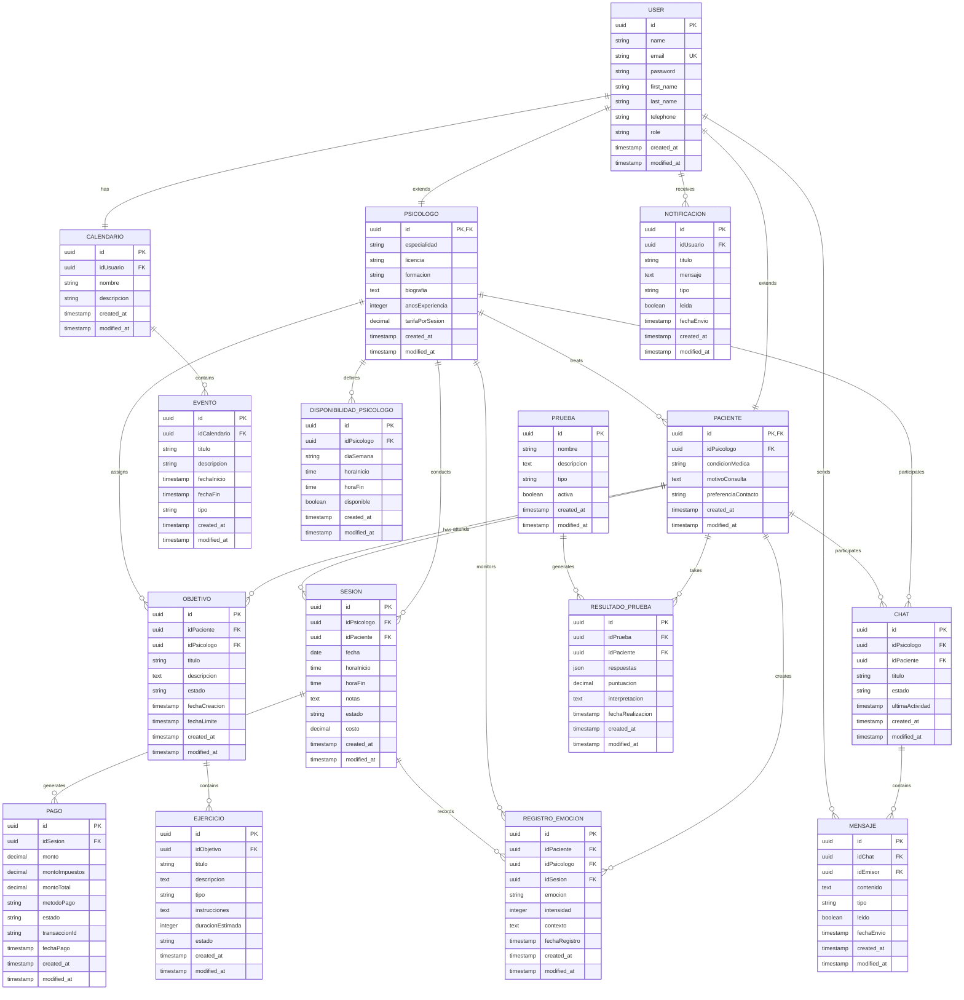

# Diagrama de Base de Datos - PsicoWeb

Este diagrama de entidad-relación (ERD) muestra la estructura de la base de datos PostgreSQL del sistema PsicoWeb, incluyendo todas las tablas, campos, claves y relaciones.



## Optimizaciones Aplicadas - Eliminación de Ciclos Redundantes

### ❌ **Redundancias Eliminadas:**

#### 1. **PAGO - FK redundante eliminada:**
- **Antes**: `uuid idPaciente FK` (redundante)
- **Después**: Solo `uuid idSesion FK`
- **Justificación**: El paciente se obtiene vía `PAGO.idSesion → SESION.idPaciente`

#### 2. **MENSAJE - FKs redundantes eliminadas:**
- **Antes**: `uuid idPsicologo FK`, `uuid idPaciente FK` (redundantes)
- **Después**: Solo `uuid idChat FK`, `uuid idEmisor FK`
- **Justificación**: Psicólogo y paciente se obtienen del chat

#### 3. **NOTIFICACION - Nueva tabla agregada:**
- Evita duplicar notificaciones en múltiples tablas
- Relación directa con USER para máxima flexibilidad

### ✅ **Beneficios de la Optimización:**

#### **Rendimiento:**
- Menos JOINs innecesarios
- Índices más eficientes
- Consultas más rápidas

#### **Integridad:**
- Eliminación de inconsistencias potenciales
- Punto único de verdad para cada relación
- Menor riesgo de datos huérfanos

#### **Mantenimiento:**
- Menos campos que sincronizar
- Actualizaciones más simples
- Migraciones menos complejas

### 🔍 **Índices Recomendados:**

```sql
-- Índices principales para rendimiento
CREATE INDEX idx_user_email ON USER(email);
CREATE INDEX idx_sesion_fecha ON SESION(fecha);
CREATE INDEX idx_pago_fecha ON PAGO(fechaPago);
CREATE INDEX idx_mensaje_fecha ON MENSAJE(fechaEnvio);
CREATE INDEX idx_paciente_psicologo ON PACIENTE(idPsicologo);
CREATE INDEX idx_chat_participantes ON CHAT(idPsicologo, idPaciente);

-- Índices compuestos para consultas frecuentes
CREATE INDEX idx_sesion_psicologo_fecha ON SESION(idPsicologo, fecha);
CREATE INDEX idx_sesion_paciente_fecha ON SESION(idPaciente, fecha);
```

### 🔒 **Restricciones de Integridad:**

```sql
-- Restricciones ON DELETE/UPDATE recomendadas
PSICOLOGO.id → USER.id (ON DELETE CASCADE)
PACIENTE.id → USER.id (ON DELETE CASCADE)
PACIENTE.idPsicologo → PSICOLOGO.id (ON DELETE SET NULL)
SESION.idPsicologo → PSICOLOGO.id (ON DELETE CASCADE)
SESION.idPaciente → PACIENTE.id (ON DELETE CASCADE)
CHAT.idPsicologo → PSICOLOGO.id (ON DELETE CASCADE)
CHAT.idPaciente → PACIENTE.id (ON DELETE CASCADE)
MENSAJE.idChat → CHAT.id (ON DELETE CASCADE)
MENSAJE.idEmisor → USER.id (ON DELETE CASCADE)
PAGO.idSesion → SESION.id (ON DELETE CASCADE)
```

## Descripción de las Tablas

### Tablas Principales de Usuario

- **USER**: Tabla base que almacena información común de todos los usuarios del sistema
- **PSICOLOGO**: Extensión de USER para profesionales de salud mental
- **PACIENTE**: Extensión de USER para usuarios que buscan atención psicológica

### Tablas de Gestión de Sesiones

- **SESION**: Registra las citas entre psicólogos y pacientes
- **PAGO**: Almacena las transacciones de pago por las sesiones
- **DISPONIBILIDAD_PSICOLOGO**: Define los horarios disponibles de cada psicólogo

### Tablas de Comunicación

- **CHAT**: Canales de comunicación entre psicólogo y paciente
- **MENSAJE**: Mensajes individuales dentro de cada chat

### Tablas de Gestión Terapéutica

- **OBJETIVO**: Metas terapéuticas asignadas a pacientes
- **EJERCICIO**: Actividades específicas para alcanzar objetivos
- **REGISTRO_EMOCION**: Seguimiento del estado emocional de los pacientes

### Tablas de Evaluación

- **PRUEBA**: Cuestionarios y tests psicológicos
- **RESULTADO_PRUEBA**: Resultados de las pruebas realizadas por pacientes

### Tablas de Calendario

- **CALENDARIO**: Calendarios personales de usuarios
- **EVENTO**: Eventos específicos en los calendarios

## Claves y Restricciones

### Claves Primarias (PK)
- Todas las tablas usan UUID como clave primaria para mejor distribución y seguridad

### Claves Foráneas (FK)
- **PSICOLOGO.id**: Referencia a USER.id
- **PACIENTE.id**: Referencia a USER.id
- **PACIENTE.idPsicologo**: Referencia a PSICOLOGO.id
- **SESION.idPsicologo**: Referencia a PSICOLOGO.id
- **SESION.idPaciente**: Referencia a PACIENTE.id
- **Y muchas más relaciones que conectan las entidades**

### Claves Únicas (UK)
- **USER.email**: Garantiza que cada email sea único en el sistema

## Características Técnicas

1. **Tipos de Datos**:
   - UUID para identificadores únicos
   - TIMESTAMP para fechas y horas
   - DECIMAL para valores monetarios
   - JSON para datos estructurados flexibles
   - TEXT para contenido largo

2. **Integridad Referencial**:
   - Todas las relaciones padre-hijo están protegidas con claves foráneas
   - Cascadas configuradas apropiadamente (CASCADE, SET NULL)

3. **Auditoría**:
   - Campos created_at y modified_at en todas las tablas
   - Timestamp automático de registro de actividades

4. **Escalabilidad**:
   - Uso de UUIDs permite distribución en múltiples bases de datos
   - Estructura normalizada evita redundancia de datos

## Flujo de Datos Principal

1. **Registro**: Usuario se registra en USER, se crea perfil en PSICOLOGO o PACIENTE
2. **Asignación**: Paciente es asignado a psicólogo
3. **Reserva**: Se crea SESION, automáticamente se genera CHAT y se envía correo
4. **Pago**: Se procesa PAGO vinculado a la sesión
5. **Comunicación**: Intercambio de MENSAJE a través del CHAT
6. **Seguimiento**: Registro de OBJETIVO, EJERCICIO y REGISTRO_EMOCION
7. **Evaluación**: Aplicación de PRUEBA y almacenamiento de RESULTADO_PRUEBA
