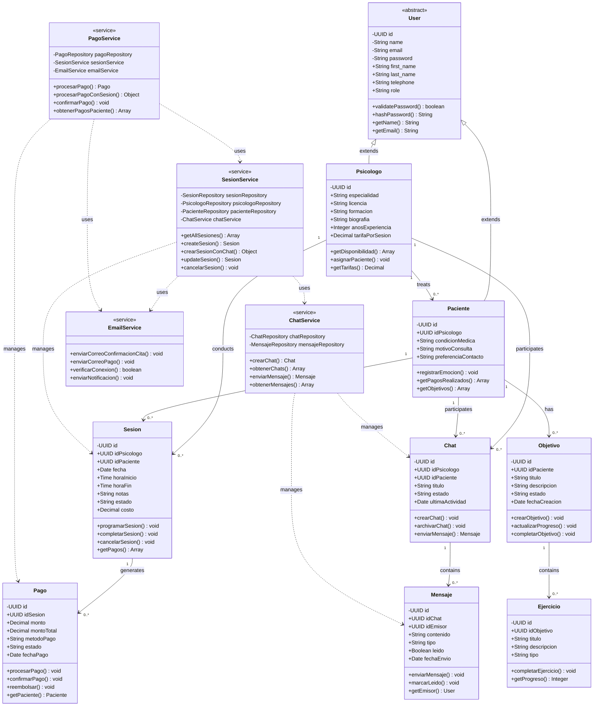

# Diagrama de Clases UML - PsicoWeb

Este diagrama muestra la estructura de clases principal del sistema PsicoWeb, incluyendo las entidades del dominio, servicios y sus relaciones.

## Descripción de las Clases Principales

### Entidades del Dominio

- **User**: Clase base abstracta que contiene información común de usuarios
- **Psicologo**: Extiende User, representa a los profesionales de salud mental
- **Paciente**: Extiende User, representa a los usuarios que buscan atención psicológica
- **Sesion**: Representa una cita/sesión entre psicólogo y paciente
- **Chat**: Canal de comunicación entre psicólogo y paciente
- **Mensaje**: Mensajes individuales dentro de un chat
- **Pago**: Transacciones de pago por sesiones
- **Objetivo**: Metas terapéuticas asignadas a pacientes
- **Ejercicio**: Actividades específicas dentro de un objetivo

### Servicios

- **SesionService**: Gestiona la lógica de negocio de las sesiones
- **PagoService**: Maneja el procesamiento de pagos y creación automática de sesiones
- **ChatService**: Administra la comunicación entre usuarios
- **EmailService**: Servicio para envío de correos electrónicos automáticos

## Relaciones Principales

1. **Herencia**: Psicologo y Paciente heredan de User
2. **Asociación**: Un psicólogo puede tener múltiples pacientes
3. **Composición**: Las sesiones, chats y pagos están vinculados a usuarios específicos
4. **Dependencia**: Los servicios dependen de las entidades para realizar operaciones

## Funcionalidades Clave

- **Gestión de Usuarios**: Registro y autenticación de psicólogos y pacientes
- **Reserva de Citas**: Creación automática de sesiones con chat y notificaciones por email
- **Sistema de Pago**: Procesamiento de pagos con creación automática de sesiones
- **Comunicación**: Chat en tiempo real entre psicólogo y paciente
- **Gestión Terapéutica**: Objetivos y ejercicios personalizados
- **Notificaciones**: Correos automáticos de confirmación de citas
